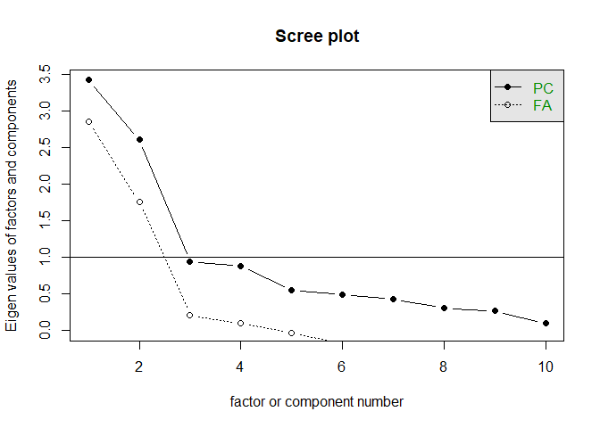
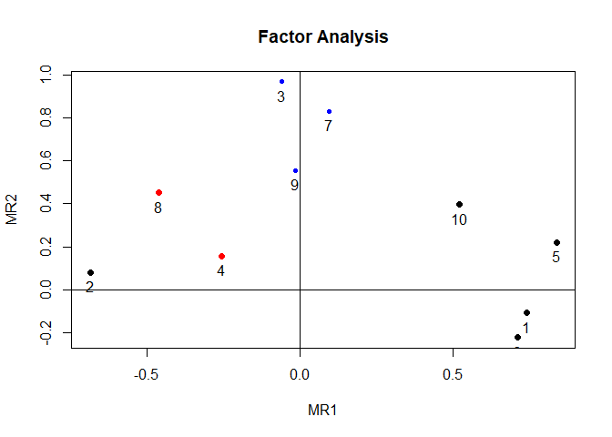
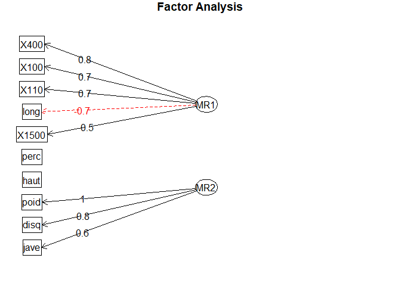

A simple introduction to Exploratory Factor Analysis using R
================
KG Wee

Introduction
------------

This document is about a simple introduction to exploratory factor analysis using R created in August 2018 for National University of Singapore Libraries (NUSL). Much of the content is inspired by the tutorials on [R-bloggers](https://www.r-bloggers.com/exploratory-factor-analysis-in-r/) and [University of Virginia Library](https://data.library.virginia.edu/getting-started-with-factor-analysis/). The data "Olympic" is from [ade4 package](https://pbil.univ-lyon1.fr/ade4/ade4-html/olympic.html).

Factor Analysis
---------------

Factor analysis starts with the assumption of hidden latent variables which cannot be observed directly but are reflected in the answers or variables of the data. The number of latent variables are always less than the number of variables in the dataset.

### Factor Loadings

Suppose we want to find out the factors that affect the performance of an athlete in decalthon. We might hypothesise that there are two factors, "strength" and "speed", neither of which is directly observed. We might want to know how much an event is determined by the two factors. For example, we may think that the average score of an athlete in the 100 metres event is `10 x Strength + 6 x Speed`. The numbers 10 and 6 are the factor loadings associated with the event.

### Oblique rotations

-   Orthogonal (`Varimax` - in R): Factors are independent (i.e., correlations between factors are less than ~0.3)
-   Oblique (`Oblimin` - in R): Factors are related (i.e., at least some correlations between factors are greater than ~0.3).

If the researcher hypothesises uncorrelated factors, then he or she can use orthogonal rotation. If the researcher hypothesises correlated factors, oblique rotation would be a better choice. By choosing a suitable rotation, the factors will be much easier to interpret and analyse.

Install necessary packages
--------------------------

We are using `psych` package in R which is a package for personality, psychometric, and psychological research. It contains useful methods to do data analysis such as multivariate analysis, factor analysis and principal component analysis. We can install the packages in Rstudio for example by running:

``` r
install.packages("psych")
install.packages("GPArotation")
```

We can include the packages by typing library("`XX`") where `XX` is the package name. Remember the quotation marks!

``` r
library("psych")
library("GPArotation")
```

The sample dataset should be in the same directory as this document.

``` r
olympic_data <- read.csv("olympic.csv")
olympic_data <- olympic_data[complete.cases(olympic_data), ]
```

How does the data look like?

    ##     X100 long  poid haut  X400  X110  disq perc  jave  X1500
    ## 1  11.25 7.43 15.48 2.27 48.90 15.13 49.28  4.7 61.32 268.95
    ## 2  10.87 7.45 14.97 1.97 47.71 14.46 44.36  5.1 61.76 273.02
    ## 3  11.18 7.44 14.20 1.97 48.29 14.81 43.66  5.2 64.16 263.20
    ## 4  10.62 7.38 15.02 2.03 49.06 14.72 44.80  4.9 64.04 285.11
    ## 5  11.02 7.43 12.92 1.97 47.44 14.40 41.20  5.2 57.46 256.64
    ## 6  10.83 7.72 13.58 2.12 48.34 14.18 43.06  4.9 52.18 274.07
    ## 7  11.18 7.05 14.12 2.06 49.34 14.39 41.68  5.7 61.60 291.20
    ## 8  11.05 6.95 15.34 2.00 48.21 14.36 41.32  4.8 63.00 265.86
    ## 9  11.15 7.12 14.52 2.03 49.15 14.66 42.36  4.9 66.46 269.62
    ## 10 11.23 7.28 15.25 1.97 48.60 14.76 48.02  5.2 59.48 292.24
    ## 11 10.94 7.45 15.34 1.97 49.94 14.25 41.86  4.8 66.64 295.89
    ## 12 11.18 7.34 14.48 1.94 49.02 15.11 42.76  4.7 65.84 256.74
    ## 13 11.02 7.29 12.92 2.06 48.23 14.94 39.54  5.0 56.80 257.85
    ## 14 10.99 7.37 13.61 1.97 47.83 14.70 43.88  4.3 66.54 268.97
    ## 15 11.03 7.45 14.20 1.97 48.94 15.44 41.66  4.7 64.00 267.48
    ## 16 11.09 7.08 14.51 2.03 49.89 14.78 43.20  4.9 57.18 268.54
    ## 17 11.46 6.75 16.07 2.00 51.28 16.06 50.66  4.8 72.60 302.42
    ## 18 11.57 7.00 16.60 1.94 49.84 15.00 46.66  4.9 60.20 286.04
    ## 19 11.07 7.04 13.41 1.94 47.97 14.96 40.38  4.5 51.50 262.41
    ## 20 10.89 7.07 15.84 1.79 49.68 15.38 45.32  4.9 60.48 277.84
    ## 21 11.52 7.36 13.93 1.94 49.99 15.64 38.82  4.6 67.04 266.42
    ## 22 11.49 7.02 13.80 2.03 50.60 15.22 39.08  4.7 60.92 262.93
    ## 23 11.38 7.08 14.31 2.00 50.24 14.97 46.34  4.4 55.68 272.68
    ## 24 11.30 6.97 13.23 2.15 49.98 15.38 38.72  4.6 54.34 277.84
    ## 25 11.00 7.23 13.15 2.03 49.73 14.96 38.06  4.5 52.82 285.57
    ## 26 11.33 6.83 11.63 2.06 48.37 15.39 37.52  4.6 55.42 270.07
    ## 27 11.10 6.98 12.69 1.82 48.63 15.13 38.04  4.7 49.52 261.90
    ## 28 11.51 7.01 14.17 1.94 51.16 15.18 45.84  4.6 56.28 303.17
    ## 29 11.26 6.90 12.41 1.88 48.24 15.61 38.02  4.4 52.68 272.06
    ## 30 11.50 7.09 12.94 1.82 49.27 15.56 42.32  4.5 53.50 293.85
    ## 31 11.43 6.22 13.98 1.91 51.25 15.88 46.18  4.6 57.84 294.99
    ## 32 11.47 6.43 12.33 1.94 50.30 15.00 38.72  4.0 57.26 293.72
    ## 33 11.57 7.19 10.27 1.91 50.71 16.20 34.36  4.1 54.94 269.98

It is a dataset that gives the performances of 33 men's decathlon at the Olympic Games (1988). It includes 33 rows and 10 columns events of the decathlon: 100 meters (X100), long jump (long), shotput (poid), high jump (haut), 400 meters (X400), 110-meter hurdles (X110), discus throw (disq), pole vault (perc), javelin (jave) and 1500 meters (X1500).

In order to find out the factors, we need to know how well the variables are correlated to each other. We can use the correlations to predict relationships between two measurements, for example. In general, the presence of a correlation does not infer the presence of a causal relationship ("correlation does not imply causation").

Correlation matrix
------------------

A correlation matrix is a table showing correlation coeffcients between sets of variables.

``` r
olympic_cor <- cor(olympic_data)
olympic_cor
```

    ##              X100        long        poid        haut        X400
    ## X100   1.00000000 -0.53956763 -0.20797283 -0.14590755  0.60589539
    ## long  -0.53956763  1.00000000  0.14189682  0.27313528 -0.51532883
    ## poid  -0.20797283  0.14189682  1.00000000  0.12207562  0.09458277
    ## haut  -0.14590755  0.27313528  0.12207562  1.00000000 -0.08750434
    ## X400   0.60589539 -0.51532883  0.09458277 -0.08750434  1.00000000
    ## X110   0.63836152 -0.47799594 -0.29571686 -0.30673504  0.54602764
    ## disq  -0.04722423  0.04192321  0.80635220  0.14742183  0.14218823
    ## perc  -0.38913812  0.34992555  0.47997834  0.21322557 -0.31865911
    ## jave  -0.06471440  0.18166750  0.59767262  0.11593538  0.12035232
    ## X1500  0.26103415 -0.39558645  0.26882944 -0.11408736  0.58728182
    ##              X110        disq        perc        jave       X1500
    ## X100   0.63836152 -0.04722423 -0.38913812 -0.06471440  0.26103415
    ## long  -0.47799594  0.04192321  0.34992555  0.18166750 -0.39558645
    ## poid  -0.29571686  0.80635220  0.47997834  0.59767262  0.26882944
    ## haut  -0.30673504  0.14742183  0.21322557  0.11593538 -0.11408736
    ## X400   0.54602764  0.14218823 -0.31865911  0.12035232  0.58728182
    ## X110   1.00000000 -0.11049751 -0.52154860 -0.06282187  0.14329760
    ## disq  -0.11049751  1.00000000  0.34396570  0.44290752  0.40231998
    ## perc  -0.52154860  0.34396570  1.00000000  0.27424163 -0.03149506
    ## jave  -0.06282187  0.44290752  0.27424163  1.00000000  0.09637566
    ## X1500  0.14329760  0.40231998 -0.03149506  0.09637566  1.00000000

Scree Plot
----------

The scree plot maps the factors with their eigenvalues and a cut-off point is determined wherever there is a sudden change in the slope of the line. The point where the slope levels off (the "elbow") indicates the number of factors that should be included in our analysis.

``` r
scree(olympic_cor)
```



Keep in mind that one of the objectives in factor analysis is to reduce the large number of variables to a few interpretable latent variables (factors). We would like to find as few as factors to explain the maximum amount of variability in the data. Based on the plot, 2 or 3 factors appear to be sufficient. Again, it depends on our models and how we can interpret the factors.

Factor Analysis
---------------

We are going to use a function called `fa()` in `psych` package to carry out exploratory factor analysis. It provides several methods to estimate the factor loadings with the "minimum residual method" as the default. Check out the documentation for more details.

Let's run the analysis for both cases with 2 and 3 factors:

``` r
factors_data_2 <- fa(r = olympic_cor, nfactors = 2, n.obs = 33)
factors_data_3 <- fa(r = olympic_cor, nfactors = 3, n.obs = 33)
```

What does the result tell us? Let's look at the `factors_data_2`:

    ## Factor Analysis using method =  minres
    ## Call: fa(r = olympic_cor, nfactors = 2, n.obs = 33)
    ## Standardized loadings (pattern matrix) based upon correlation matrix
    ##         MR1   MR2    h2    u2 com
    ## X100   0.74 -0.11 0.575 0.425 1.0
    ## long  -0.68  0.08 0.484 0.516 1.0
    ## poid  -0.06  0.97 0.945 0.055 1.0
    ## haut  -0.25  0.16 0.094 0.906 1.7
    ## X400   0.84  0.22 0.728 0.272 1.1
    ## X110   0.71 -0.22 0.579 0.421 1.2
    ## disq   0.10  0.83 0.689 0.311 1.0
    ## perc  -0.46  0.45 0.445 0.555 2.0
    ## jave  -0.01  0.56 0.309 0.691 1.0
    ## X1500  0.52  0.40 0.401 0.599 1.9
    ## 
    ##                        MR1  MR2
    ## SS loadings           2.81 2.44
    ## Proportion Var        0.28 0.24
    ## Cumulative Var        0.28 0.52
    ## Proportion Explained  0.53 0.47
    ## Cumulative Proportion 0.53 1.00
    ## 
    ##  With factor correlations of 
    ##       MR1   MR2
    ## MR1  1.00 -0.07
    ## MR2 -0.07  1.00
    ## 
    ## Mean item complexity =  1.3
    ## Test of the hypothesis that 2 factors are sufficient.
    ## 
    ## The degrees of freedom for the null model are  45  and the objective function was  4.93 with Chi Square of  137.14
    ## The degrees of freedom for the model are 26  and the objective function was  0.74 
    ## 
    ## The root mean square of the residuals (RMSR) is  0.05 
    ## The df corrected root mean square of the residuals is  0.07 
    ## 
    ## The harmonic number of observations is  33 with the empirical chi square  8.94  with prob <  1 
    ## The total number of observations was  33  with Likelihood Chi Square =  19.67  with prob <  0.81 
    ## 
    ## Tucker Lewis Index of factoring reliability =  1.128
    ## RMSEA index =  0  and the 90 % confidence intervals are  0 0.091
    ## BIC =  -71.24
    ## Fit based upon off diagonal values = 0.98
    ## Measures of factor score adequacy             
    ##                                                    MR1  MR2
    ## Correlation of (regression) scores with factors   0.94 0.98
    ## Multiple R square of scores with factors          0.88 0.96
    ## Minimum correlation of possible factor scores     0.75 0.93

That's a lot of output! In the first table, `MR1` and `MR2` refer to the factors, and the numbers are the loadings of each variable on each factor. We want groups of high numbers. For example, under MR1, we can see that `X100`, `X400` and `x110` (100 metres, 400 metres and 110-metre hurdles) have high loadings on MR1. Hence, we might be able to explain MR1 as "speed".

`h2` refers to communality estimate, a measurement of the amount of variance in an observed variable explained by the factors. Usually we want a high communality so that the factors are sufficient to explain the variables. `u2` is called uniqueness, which tells us how much the variable does not fit into our model with the indicated factors.

In the next table, we can see how much variance is contributed by the respective factors.

    ##                             MR1       MR2
    ## SS loadings           2.8080656 2.4414254
    ## Proportion Var        0.2808066 0.2441425
    ## Cumulative Var        0.2808066 0.5249491
    ## Proportion Explained  0.5349215 0.4650785
    ## Cumulative Proportion 0.5349215 1.0000000

We are interested in `cumulative variance` (the third row). The two-factor model can explained 53% of variance in the data, which is not bad. Usually, a good model should explain 50%-70% of variance. Of course, we can add more factors to see how much the number will increase.

The `SS loadings` row is the sum of squared loadings. We say that a factor is worth keeping if the SS loading is greater than 1. It looks like our factors are good to go!

Visualisation of the result
---------------------------

We can plot the results of `fa()` to see the loadings of each variable on the factors. The variables are assigned to clusters by their highest loading. The flag `Cut` is the cut-off point of the loadings.

``` r
fa.plot(factors_data_2, cut = 0.5)
```



We can also plot the result in a diagram in which the variables and factors are represented by nodes, and the loadings as edges.

``` r
fa.diagram(factors_data_2, cut = 0.5)
```



It is clear that all the track events (`X400, X100, X110, X1500`) are positively associated with MR1, and most field events (`poid, disq, jave`) with MR2. Hence, we may model MR1 as speed and MR2 as strength.

Built with R 3.5.0
